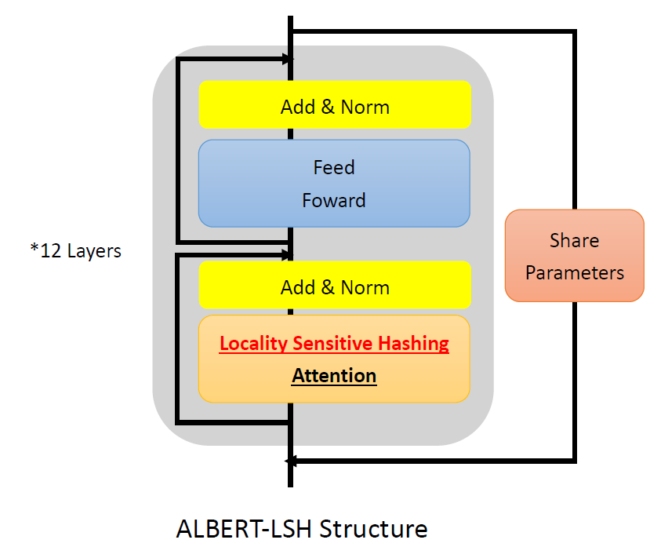
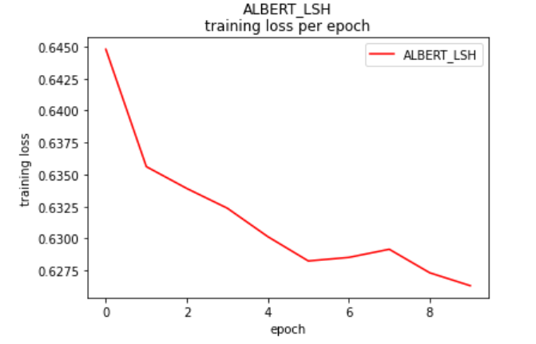
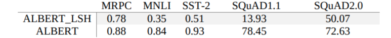

# Locality Sensitive Hashing on ALBERT
Discuss the impact when locality sensitive hashing from reformer is implemented on ALBERT, a lite BERT.  
## Introduction  
Space computational costs and time complexities are more and more important in the era of large language models. ALBERT greatly reduces
the time and space needed for training a language model. Furthermore, Locality Sensitive Hashing attention mechanism also improves on language
model's space complexity.  
## Purpose
We would like to experiment whether it will achieve a better result if the attention layer for ALBERT is replaced by locality sensitive hashing. 
## Paperworks
[Report](files/report_A47.pdf)  
[Poster](files/poster_A47.pdf)   
[Summary](files/summary_A47.pdf)   
## Model selection
### Locality Sensitive Hashingd
Locality Sensitive Hashing is an attention mechanism that replaces the original dot-product attention and reduces the former space complexity of  O(N2) to O(N lg N). It randomly permutes Q vectors several rounds and hashes each qi into several buckets. This process finds related qis and computes them into attention matrix with lower cost.  

### Model building
We connected locality sensitive hashing attention layer on ALBERT structure (fig 1). For training process, we use standard ALBERT pre-train model provided by Google for pre-training, then fine-tune it to specific tasks. The experiment is done on Google Colab with GPU P100.  

## Experiments
### Model Correctness
We want to know that if locality sensitive hashing works on ALBERT. We train ALBERT-LSH on MRPC with 10 epochs, and we can see that the training loss is converging.   

### Model Accuracy
We test ALBERT-LSH on multiple test sets and compare it with ALBERT.  

## Conclusion
Implementing Locality Sensitive Hashing on natural language processing tasks is workable. It reduces space needed for module to compute therefore we can construct a larger module. It is a trade-off between space and time. Our ALBERT_LSH uses less space, but hashing loses some text feature and decreases accuracies. We need further experiments to determine whether our module needs more time to train, or it is already the limit of LSH attention mechanism.  
## Installation
```
pip install transformers
pip install pytorch-reformer
```
replace contents in transformers/modeling_albert.py with contents in ALBERT_LSH.py.  
Run each testset.
## run GLUE
```
python download_glue.py
```
```
python run_glue.py \
  --model_type bert \
  --model_name_or_path albert-base-v2 \
  --task_name $TASK_NAME \
  --do_train \
  --do_eval \
  --data_dir $GLUE_DIR/$TASK_NAME \
  --max_seq_length 64 \
  --per_gpu_train_batch_size 8 \
  --learning_rate 1e-5 \
  --num_train_epochs 3.0 \
  --output_dir /tmp/$TASK_NAME/
```
## run SQuADs
```
python run_squad.py \
  --model_type albert \
  --model_name_or_path albert-base-v2 \
  --do_train \
  --do_eval \
  --do_lower_case \
  --train_file $SQUAD_DIR/train-v1.1.json \
  --predict_file $SQUAD_DIR/dev-v1.1.json \
  --per_gpu_train_batch_size 12 \
  --learning_rate 3e-5 \
  --num_train_epochs 2.0 \
  --max_seq_length 384 \
  --doc_stride 128 \
  --output_dir /tmp/debug_squad/
```